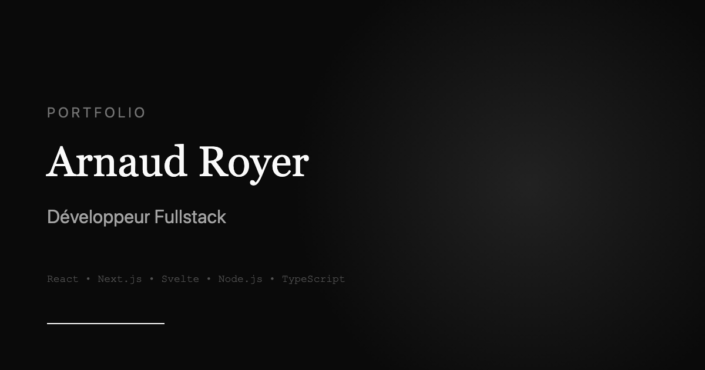

# Portfolio - Arnaud Royer


Portfolio personnel présentant mes projets, expériences et compétences en tant que développeur Fullstack.

🌐 **[arnaud-royer.xyz](https://arnaud-royer.xyz)**



---

## ✨ Fonctionnalités

- **Design moderne** avec animations GSAP et smooth scroll
- **Responsive** mobile-first
- **SEO optimisé** (métadonnées, sitemap, JSON-LD)
- **Formulaire de contact** avec EmailJS
- **Performance optimale** avec Next.js App Router

---

## 🛠️ Stack Technique

| Catégorie | Technologies |
|-----------|-------------|
| **Framework** | Next.js 16 (App Router) |
| **UI** | React 19, Tailwind CSS 4 |
| **Langage** | TypeScript 5 |
| **Animations** | GSAP, ScrollTrigger, ScrollSmoother |
| **Emails** | EmailJS |
| **Déploiement** | Vercel |

---

## 🚀 Installation

### Prérequis

- Node.js 18+
- npm, yarn ou pnpm

### Étapes

```bash
# Cloner le repository
git clone https://github.com/itsmusic/Portfolio.git
cd Portfolio

# Installer les dépendances
npm install

# Copier les variables d'environnement
cp .env.example .env

# Lancer en développement
npm run dev
```

Ouvrir [http://localhost:3000](http://localhost:3000) dans votre navigateur.

---

## ⚙️ Variables d'environnement

Créer un fichier `.env` à la racine :

```env
# URL du site (pour SEO et sitemap)
NEXT_PUBLIC_SITE_URL=https://arnaud-royer.xyz

# EmailJS (formulaire de contact)
NEXT_PUBLIC_EMAILJS_SERVICE_ID=your_service_id
NEXT_PUBLIC_EMAILJS_TEMPLATE_ID=your_template_id
NEXT_PUBLIC_EMAILJS_PUBLIC_KEY=your_public_key
```

---

## 📁 Structure du projet

```
Portfolio/
├── public/
│   ├── files/          # CV PDF
│   ├── icons/          # Icônes PWA
│   └── images/         # Images (OG, projets, profil)
├── src/
│   ├── app/            # Pages Next.js (App Router)
│   │   ├── about/
│   │   ├── contact/
│   │   ├── experiences/
│   │   ├── projects/
│   │   └── layout.tsx
│   ├── components/
│   │   ├── gsap/       # Composants d'animation
│   │   ├── seo/        # JSON-LD schemas
│   │   └── ui/         # Composants réutilisables
│   └── lib/
│       └── data.js     # Données (projets, expériences)
├── .env.example
├── package.json
└── README.md
```

---

## 📜 Scripts

| Commande | Description |
|----------|-------------|
| `npm run dev` | Lancer en mode développement |
| `npm run build` | Build de production |
| `npm run start` | Lancer le build de production |
| `npm run lint` | Vérifier le code avec ESLint |

---

## 🌐 Déploiement

Le site est déployé automatiquement sur **Vercel** à chaque push sur la branche `main`.

[](https://vercel.com/new/clone?repository-url=https://github.com/itsmusic/Portfolio)

---

## 📄 License

Ce projet est sous licence MIT. Voir le fichier [LICENSE](LICENSE) pour plus de détails.

---

## 👤 Auteur

**Arnaud Royer**

- Portfolio : [arnaud-royer.xyz](https://arnaud-royer.xyz)
- GitHub : [@itsarnaud](https://github.com/itsarnaud)
- LinkedIn : [Arnaud Royer](https://www.linkedin.com/in/royer-arnaud/)
- Email : arnaud.royer77@gmail.com

---

<p align="center">
  Fait avec ❤️ et ☕ par Arnaud Royer
</p>
